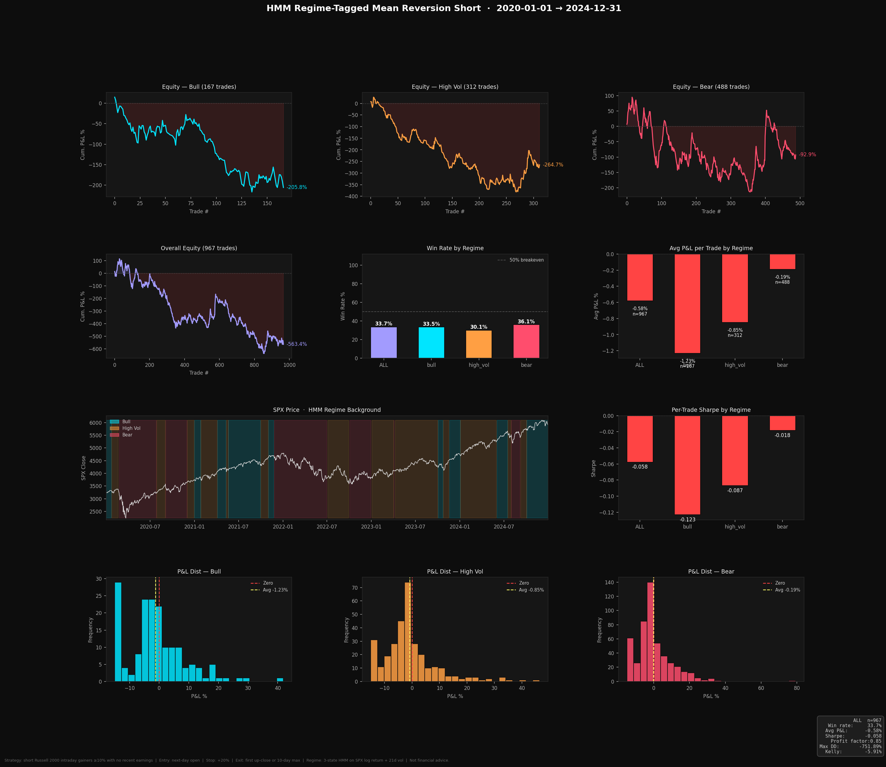

# hmm-mean-reversion

This combines two of my earlier projects: an HMM regime detection model on the
S&P 500, and a mean reversion short strategy on Russell 2000 small caps. The
short strategy looked promising over a 30-day catalyst-filtered backtest, so
the question here was whether it holds up over 5 years (2020-2024), and whether
filtering trades by market regime improves it.

Short answer: no, and the way it fails is the interesting part.

## The strategy

Short any Russell 2000 stock (>$5) that closes 10%+ above its open with no
earnings release within 3 days. Enter at that day's close, cover on the first
green day, a 15% stop, or after 10 days. Every trade gets tagged with the
previous day's SPX regime (bull / high_vol / bear) from a 3-state Gaussian HMM
on daily log returns and 21-day rolling vol.

## What happened

When the HMM is fit on the full 2020-2024 window, high_vol trades break even
(+0.07%/trade) while bull and bear trades lose, which looks like a usable
filter. But that fit is in-sample: the model has already seen the whole period
it's labelling.

Refitting walk-forward instead (quarterly refits on an expanding window
starting from 2015, so each day is labelled by a model that never saw it)
kills the effect completely:

| regime   | trades | avg P&L | profit factor |
|----------|--------|---------|---------------|
| bear     | 488    | -0.19%  | 0.95          |
| high_vol | 312    | -0.85%  | 0.78          |
| bull     | 167    | -1.23%  | 0.72          |

The labels themselves are unstable. The in-sample model called 46 days "bear"
across five years; the walk-forward version called 412, because a model
trained on 2015-2019 reads 2020s volatility very differently. Ranking states
by mean return after every refit doesn't pin them to consistent market
conditions.



A few other things from digging through the trades (`analyze_trades.py`):

- Exiting at the next day's open (overnight move only) is the least-bad
  version: -0.11%/trade vs -0.58% for the full exit rules. The overnight fade
  idea points the right way, it's just not big enough.
- Spikes on >10x average volume are the worst losers (-4 to -5%/trade), which
  fits the original thesis that news-driven moves don't fade. They're too rare
  for excluding them to fix the aggregate.
- Spike size, price tier, prior run-up, extension over the 20d MA, day of
  week: nothing stable.

Caveats worth knowing: the universe is built from current tickers so delisted
names are missing (survivorship), the earnings filter misses non-earnings
catalysts like FDA news and M&A, and there are no borrow costs in the P&L —
which would only make things worse.

## Running it

```
pip install -r requirements.txt
python -X utf8 main.py
python -X utf8 analyze_trades.py
```

First run downloads ~5 years of prices plus earnings dates and caches both as
.pkl files, after that it's fast.

Not financial advice.
